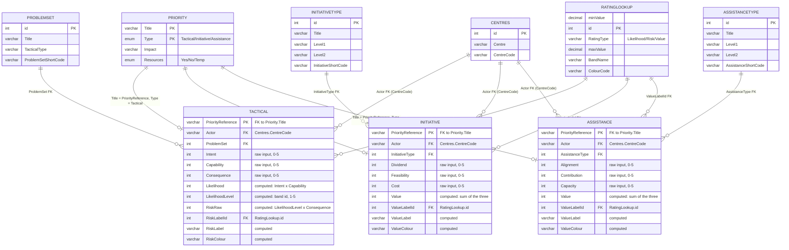
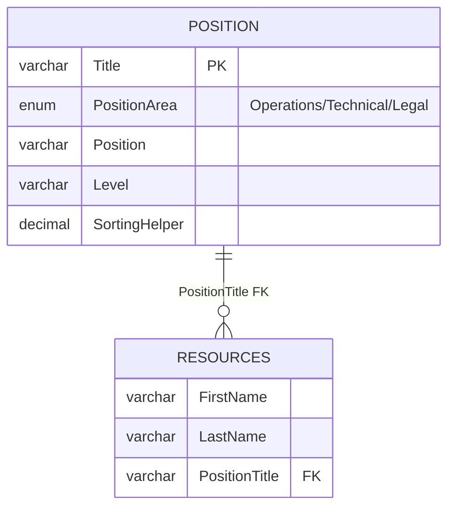
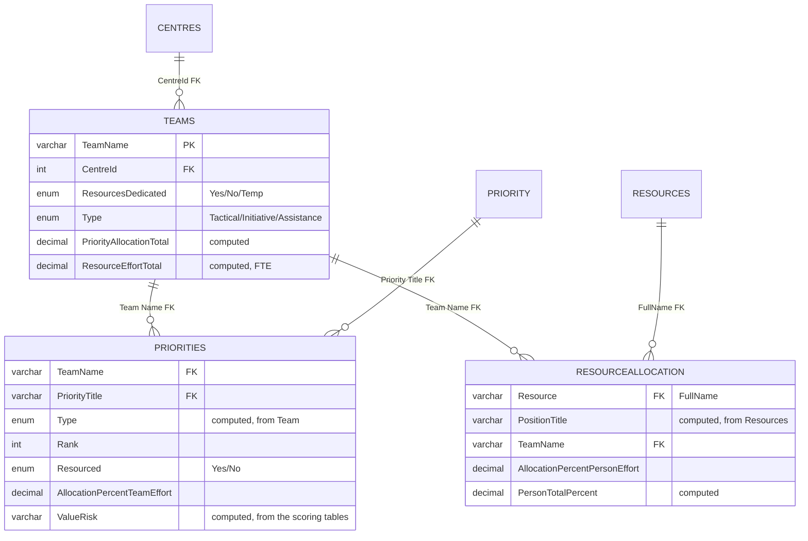

# Technical Guide for Management's Technical Prime

## Audience and purpose

This is for whoever on the Management side needs to understand the data
model itself — for governance, auditing, or planning a change — without
necessarily being the person who runs the Python build scripts (that
workflow is [`management-user-guide.md`](management-user-guide.md); the
build recipe itself is [`excel-file-design.md`](excel-file-design.md)).

The canonical schema is [`data-model/priorities.dbml`](../data-model/priorities.dbml)
(DBML format — [dbdiagram.io](https://dbdiagram.io) or the
[VS Code DBML extension](https://marketplace.visualstudio.com/items?itemName=matt-meyers.vscode-dbml)
can render it directly). The diagrams below are derived from it, split into
three pages by theme for legibility, each sized to fit comfortably on a
Letter-size page.

## How to read these diagrams

Standard crow's-foot notation: `||` = exactly one, `o{` = zero or more.
`PK` = primary key, `FK` = foreign key. Computed columns (Excel formulas,
not something anyone types) are marked "computed."

## 1. Scoring engine (Preparation phase)

The core of the model: every Priority gets scored on exactly one of three
tracks depending on its Type, each pulling from its own small set of
category lookups and sharing one banding table.

**As-built note**: in each of the six centre files, `PRIORITY` is split
three ways by Type — `PriorityTactical`/`PriorityInitiative`/
`PriorityAssistance` — and `TACTICAL`/`INITIATIVE`/`ASSISTANCE` are renamed
`TacticalScores`/`InitiativeScores`/`AssistanceScores` (a naming collision
with Step 2's dependent-dropdown names, unrelated to the data model itself).
See [`management-user-guide.md`](management-user-guide.md) for why the
split exists and [`excel-file-design.md`](excel-file-design.md) for the
full technical reasoning. `preparation.xlsx` itself keeps the single
`Priority`/`Tactical`/`Initiative`/`Assistance` tables shown above.

## 2. People and positions

The smallest, simplest piece of the model — deliberately kept that way.

**As-built note**: every copy of `Resources` (in `preparation.xlsx` and
every centre file) carries a computed `FullName` column
(`=FirstName & " " & LastName`) not in the DBML — it's what Step 3's
Resource picker and every downstream FK to a Resource actually key off,
since the DBML's `(FirstName, LastName)` composite isn't practical as an
Excel dropdown/lookup key.

## 3. Centre Lead data entry (Steps 1-3)

What each centre file's own three input tables look like, and how they
relate back to the reference data above.

**As-built note, a real simplification from the draft DBML**: the draft
schema has two separate tables for Step 2 — `TeamPriorities` (rank) and
`TeamPriorityAllocation` (% of team effort) — with the same composite key.
The built workbooks merge these into one table, `Priorities` (the "Step 2 -
Priorities & Ranking" sheet), since a Centre Lead ranks and allocates a
Priority in the same action; splitting them into two tables/sheets would
have meant re-picking the same Team+Priority twice for no benefit. This
isn't yet listed in `excel-file-design.md`'s "Data model simplifications"
section — added there alongside this guide.

## Data model simplifications — quick reference

Full reasoning in `excel-file-design.md`; summarized here against the
diagrams above:

1. The six raw 0-5 scoring inputs are left as plain numbers — only the
   computed outcomes (Likelihood, Risk, Value) are banded/coloured.
2. `RiskRaw` = `LikelihoodLevel` (the 1-5 band index) × `Consequence`, not
   the raw 0-25 Likelihood × Consequence — the draft's wording was
   ambiguous between the two.
3. `Actor` is a Centres FK (`CentreCode`), not the draft's fixed
   Ottawa/Gatineau/Toronto enum, so it works for all six real centres.
4. `Priority.Title` is the join key everywhere (matching the DBML's
   `(Title, Type)` composite), not a surrogate ID.
5. `Resources`' FK key is a computed `FullName`, not the DBML's
   `(FirstName, LastName)` composite.
6. Step 2's `TeamPriorities` + `TeamPriorityAllocation` are merged into one
   table, `Priorities`.
7. `Priority` is split three ways by Type in every centre file (not in
   `preparation.xlsx`) — an implementation detail for live-refresh safety,
   not a schema change; see diagram 1's as-built note.

## Where each entity physically lives

| DBML entity | `preparation.xlsx` | Centre file (`Centre-*.xlsx`) |
|---|---|---|
| Centres, Position, Resources, ProblemSet, InitiativeType, AssistanceType | Same names | Same names, Power-Query-refreshed from `preparation.xlsx` |
| Priority | `Priority` | `PriorityTactical` / `PriorityInitiative` / `PriorityAssistance` |
| Tactical / Initiative / Assistance | `Tactical` / `Initiative` / `Assistance` | `TacticalScores` / `InitiativeScores` / `AssistanceScores` |
| RatingLookup | `RatingLookup` | `RatingLookup` — the one table that's a static copy, not live-refreshed |
| Teams | — (Centre Lead's own data) | Sheet "Step 1 - Teams", table `Teams` |
| TeamPriorities + TeamPriorityAllocation | — | Sheet "Step 2 - Priorities & Ranking", table `Priorities` |
| ResourceAllocation | — | Sheet "Step 3 - Resource Allocation", table `ResourceAllocation` |

The Consolidation workbook (`consolidation.xlsx`) doesn't introduce new
entities — it combines `Teams`/`Priorities`/`ResourceAllocation` across all
six centre files (as `Teams_All`/`Priorities_All`/`ResourceAllocation_All`)
via a composite `TeamKey` (`CentreCode | Team Name`, since Team Name alone
collides across centres), plus reference copies of `Centres`, `Priority`,
and `Resources`. See `excel-file-design.md`'s "Consolidation workbook"
section for that recipe in full.

## Related docs

- [`data-model/priorities.dbml`](../data-model/priorities.dbml) — the
  canonical schema these diagrams are derived from.
- [`excel-file-design.md`](excel-file-design.md) — full technical design:
  every workbook, every build script, every gotcha found along the way.
- [`management-user-guide.md`](management-user-guide.md) — the practical,
  non-technical workflow guide.
- [`centre-lead-user-guide.md`](centre-lead-user-guide.md) — what Centre
  Leads see and do.
