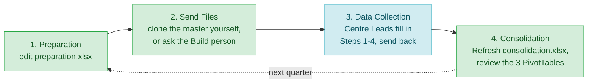
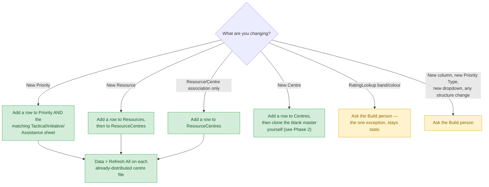

# User Guide for Management

## What this covers

Your role across the quarterly cycle, in plain Excel terms — what you can do
yourself versus what needs to come from whoever maintains and generates
these workbooks (called "the Build person" below).

The short version: **routine reference-data changes are Excel-only now** — a
new Priority, a new Resource, a new Centre. Edit `preparation.xlsx` directly
and hit **Data > Refresh All** on the distributed centre files. Even
**creating a brand-new centre's file** can be done yourself, by cloning the
blank master template (see [Phase 2](#2-send-data-collection-files) below).
Only genuinely **structural changes** — a new column, a new Priority Type,
or anything about `RatingLookup` — need the Build person. The rest of this
guide tells you which is which.

## The quarterly cycle

Green = you, in Excel, on your own.
Amber = needs the Build person.
Blue = the Centre Lead's part (see
[`centre-lead-user-guide.md`](centre-lead-user-guide.md)).

## 1. Preparation — editing `preparation.xlsx`

This workbook holds every piece of reference data the six centre files and
the Consolidation workbook are built from. You edit it directly in Excel —
always could, this part never needed the Build person.

| Sheet | Holds | Columns |
|---|---|---|
| Centres | The six centres | Centre, CentreCode |
| Position | Job titles/levels | Title, PositionArea, Position, Level |
| Resources | People | FirstName, LastName, PositionTitle |
| ResourceCentres | Which Centre(s) each person is associated with | Resource, CentreCode |
| Priority | Every priority, all three types | Title, Type, Impact, Resources |
| Tactical | Risk scoring for Tactical priorities | PriorityReference, Actor, ProblemSet, Intent, Capability, Consequence (Likelihood/Risk/band columns compute automatically) |
| Initiative | Value scoring for Initiative priorities | PriorityReference, Actor, InitiativeType, Dividend, Feasibility, Cost (Value/band columns compute automatically) |
| Assistance | Value scoring for Assistance priorities | PriorityReference, Actor, AssistanceType, Alignment, Contribution, Capacity (Value/band columns compute automatically) |
| ProblemSet / InitiativeType / AssistanceType | Small category lookups used by the scoring sheets | Title + a couple of descriptive columns |
| RatingLookup | Band definitions (thresholds, names, colours) for Likelihood/Risk/Value | minValue, id, RatingType, maxValue, BandName, ColourCode |

### Adding a new Priority

A Priority is really two entries, on two different sheets — both needed:

1. On **Priority**, add a row: Title (this is the name everything else
   refers back to — spell it exactly the same everywhere), Type (Tactical /
   Initiative / Assistance), Impact, Resources.
2. On the matching scoring sheet (**Tactical**, **Initiative**, or
   **Assistance** — whichever Type you picked), add a row: PriorityReference
   (must match the Title exactly), Actor, the relevant category column, and
   the raw score inputs (e.g. Intent/Capability/Consequence for Tactical).
   The Likelihood/Risk/Value and band-label/colour columns to the right are
   **formulas** — they fill in on their own once the raw inputs are there.

To add the row itself: click into the last cell of the last row and press
**Tab** (or right-click a cell in the table and choose **Insert > Table Rows
Above**) — either way Excel extends the Table properly and copies the
formula columns down. Don't just type into the blank row below a Table by
itself; on an unprotected sheet it often works, but the two methods above
are the ones Excel guarantees will behave correctly.

### Adding a new Resource

Add a row to **Resources**: FirstName, LastName, PositionTitle (spell it
exactly as it appears on the **Position** sheet). Then see "Associating a
Resource with a Centre" below — without that, the person won't show up in
*any* centre's Step 4 dropdown, even after a refresh.

### Associating a Resource with a Centre

A person only shows up in a centre's Resource picker (Step 4) if they're
associated with that centre here. Someone can be associated with more
than one Centre — this isn't exclusive, it's "which centres can pick this
person," not "which centre does this person belong to."

Add a row to **ResourceCentres** for each association: Resource (spell the
full name exactly as it appears in Resources' FullName column — first and
last name, one space between), CentreCode. A person working across two
centres gets two rows, one per centre.

This is one of the routine, Excel-only changes — no Build person needed,
just edit `preparation.xlsx` and Data > Refresh All on the distributed
files, same as adding a new Priority or Resource.

### Adding a new Centre

Add a row to **Centres**: Centre name, CentreCode. This makes the centre
*known* to the reference data — dropdowns, the Consolidation workbook, etc.
will recognize it. It does **not** create that centre's actual data-entry
file; for that, see [Phase 2](#2-send-data-collection-files) below — you can
do it yourself, no Build person needed.

### Changing RatingLookup

You can edit `RatingLookup` directly here — it's a normal Excel sheet. But
**this is the one exception to the "just refresh" story**: the six
distributed centre files do *not* pull `RatingLookup` live. It's baked in
when the Build person generates them, on purpose (see
[excel-file-design.md](excel-file-design.md#resolved-static-snapshot-vs-live-refresh-2026-09-01)
for the technical reason). If you change a band's threshold, name, or
colour, ask the Build person to regenerate and redistribute — a plain
Refresh All won't pick it up.

## 2. Send Data Collection Files

Two ways to get a centre file ready, depending on what you need.

### Option A — clone the blank master yourself (no Build person needed)

Works for a brand-new centre (after adding it to Centres, above), or
replacing a file that got lost or corrupted — **as long as nothing
structural has changed** (no new column, new Priority Type, or
`RatingLookup` change; see "When you need the Build person" below for
those). Keep a copy of the blank master template — `centre-template.xlsx`,
with Steps 1-4 empty — somewhere handy; ask the Build person for one if you
don't already have it.

1. Open the blank master template — not a centre file that already has real
   Team/Priority/Resource data typed into Steps 1-4.
2. **File > Save As**, and save it as `Centre-<CentreCode>.xlsx` (matching
   the code you used on the Centres sheet) into the folder you send from.
   Use **Save As on the open file** — not a copy-and-rename in File
   Explorer. Save As is what keeps the workbook's internal Data Model
   connections correctly pointed at itself under the new name; renaming the
   file any other way can silently leave them reading the old file's data
   instead (confirmed by testing).
3. On the **Instructions** tab: Review tab > **Unprotect Sheet** (no
   password), fill in **Centre Name** and **Centre Code**, then Review tab
   > **Protect Sheet** again (defaults are fine, no password needed).
4. **Data > Refresh All**, so the reference sheets reflect the current
   `preparation.xlsx`.
5. Double-check Steps 1-4 are still blank before sending it out.

### Option B — ask the Build person

For any structural change (see "When you need the Build person" below), or
if you'd simply rather not do Option A yourself. What comes back is
`Centre-<CentreCode>.xlsx` for each centre (filenames already match the
Centres sheet — nothing for you to rename).

Either way: distribute the finished file(s) to the right Centre Leads,
typically via SharePoint.

## 3. Data Collection — waiting on Centre Leads

Nothing to build here. Centre Leads fill in Steps 1-4 following
[`centre-lead-user-guide.md`](centre-lead-user-guide.md) and send the file
back. Once you have all six back, collect them into **one folder** — the
Consolidation workbook reads whatever's in that folder.

## 4. Consolidation — `consolidation.xlsx`, Excel only

1. Make sure all six returned files are in one folder.
2. Open `consolidation.xlsx`.
3. On the **Instructions** tab, check the **SourceFolder** cell points at
   that folder — it's a normal editable cell, update it if the folder moved.
4. **Data > Refresh All.**
5. Review the three PivotTables:
   - **Consolidated Priorities** — which priorities each centre is working.
   - **Sum of FTEs by Centre-Team** — resourcing by centre and team.
   - **Sum of FTEs by Priority** — total FTE landing on each priority across
     all six centres.

If a cell briefly shows `#GETTING_DATA` right after a refresh, that's normal
— it's Excel still populating the Data Model in the background. Give it a
few seconds and refresh again if it doesn't clear on its own.

## Routine reference-data updates, after files are already distributed

This is the workflow the live-refresh work exists for. Once a centre file
has already gone out to a Centre Lead, you can still get new Priorities or
Resources in front of them without resending the file:

That's it for the Excel-only path: edit `preparation.xlsx`, then whoever has
the distributed file (you or the Centre Lead) hits **Data > Refresh All**.
No new file needed.

## When you need the Build person

- Regenerating all six centre files after a structural change to the
  template itself (cloning the master, per Phase 2, only helps when the
  template hasn't changed).
- Any structural change: a new column, a new Priority Type, a new dropdown,
  changing how Teams/Priorities/Resource Allocation are laid out.
- Any change to `RatingLookup` (thresholds, names, colours).
- Anything that errors in a way not covered in this guide's Troubleshooting
  section below.

## Troubleshooting

- **Refresh doesn't pick up a change I made** — check the **PrepFilePath**
  cell on the centre file's Instructions tab (Config table) actually points
  at the current location of `preparation.xlsx`. If the file moved, update
  that cell, then Refresh All again.
- **A PivotTable or measure looks wrong right after refreshing** — try
  Refresh All once more; the Data Model can take a few seconds to fully
  populate (see the `#GETTING_DATA` note above).
- **Power Pivot features (PivotTables, DAX measures) don't show up at all
  in your copy of Excel** — Power Pivot ships with Office 2021 Professional
  Plus and most volume-license editions, but not retail Home & Student /
  Home & Business. Check your Office edition if this happens; raw data
  entry and everything not Data-Model-driven still works regardless.
- **A reference sheet in a distributed centre file looks stale or wrong** —
  those sheets are read-only for Centre Leads by design; if the data itself
  is wrong, fix it in `preparation.xlsx` and refresh (or ask the Build
  person, if it's a `RatingLookup` or structural issue).

## Related docs

- [`centre-lead-user-guide.md`](centre-lead-user-guide.md) — what Centre
  Leads see and do.
- [`excel-file-design.md`](excel-file-design.md) — the technical design,
  including the live-refresh architecture referenced throughout this guide.
